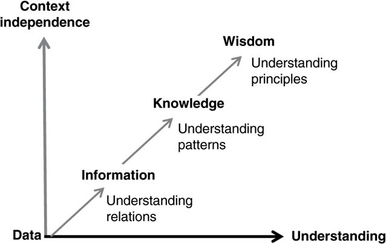
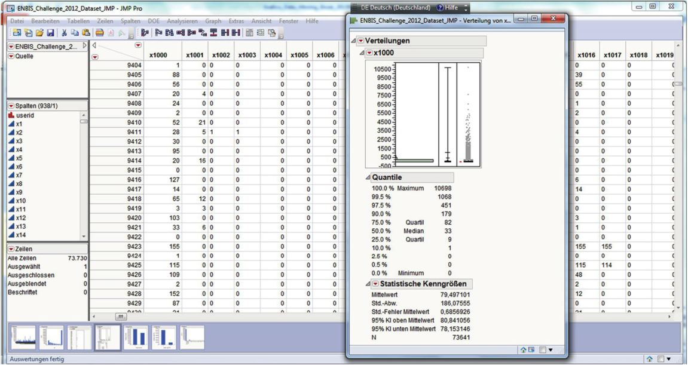
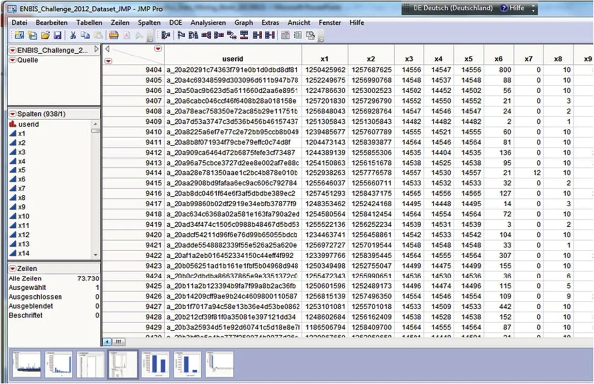
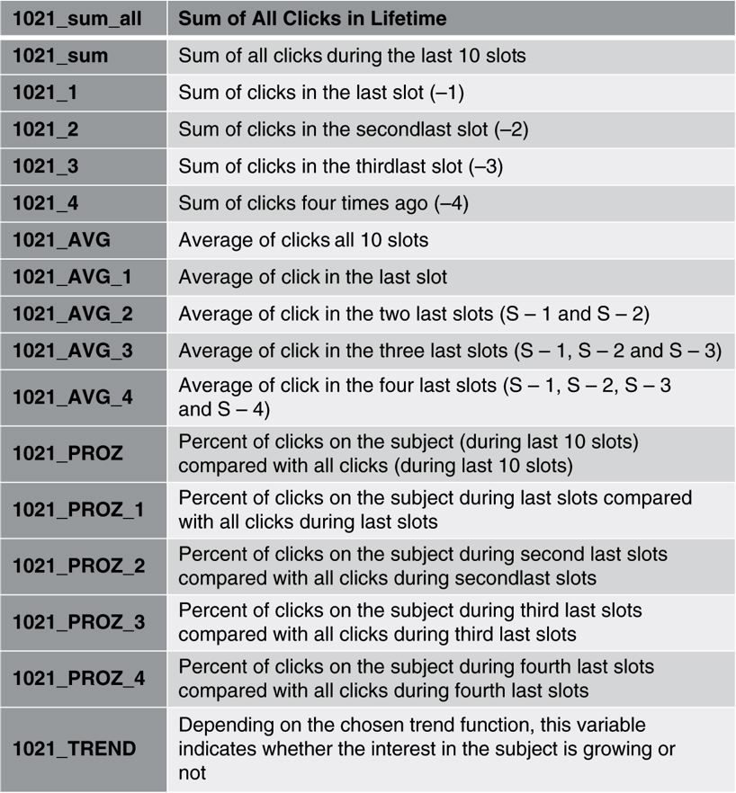

# 3 All about Data

- [3 All about Data](#3-all-about-data)
  - [3.1 SOME BASICS](#31-some-basics)
    - [3.1.1 Data, Information, Knowledge and Wisdom](#311-data-information-knowledge-and-wisdom)
    - [3.1.2 Sources and Quality of Data](#312-sources-and-quality-of-data)
    - [3.1.3 Measurement Level and Types of Data](#313-measurement-level-and-types-of-data)
    - [3.1.4 Measures of Magnitude and Dispersion](#314-measures-of-magnitude-and-dispersion)
    - [3.1.5 Data Distributions](#315-data-distributions)
  - [3.2 DATA PARTITION: RANDOM SAMPLES FOR TRAINING, TESTING AND VALIDATION](#32-data-partition-random-samples-for-training-testing-and-validation)
  - [3.3 TYPES OF BUSINESS INFORMATION SYSTEMS](#33-types-of-business-information-systems)
    - [3.3.1 Operational Systems Supporting Business Processes](#331-operational-systems-supporting-business-processes)
    - [3.3.2 Analysis-Based Information Systems](#332-analysis-based-information-systems)
    - [3.3.3 Importance of Information](#333-importance-of-information)
  - [3.4 DATA WAREHOUSES](#34-data-warehouses)
    - [3.4.1 Topic Orientation](#341-topic-orientation)
    - [3.4.2.Logical Integration and Homogenization](#342logical-integration-and-homogenization)
    - [3.4.3 Reference Period](#343-reference-period)
    - [3.4.4 Low Volatility](#344-low-volatility)
    - [3.4.5 Using the Data Warehouse](#345-using-the-data-warehouse)
  - [3.5 THREE COMPONENTS OF A DATA WAREHOUSE: DBMS, DB AND DBCS](#35-three-components-of-a-data-warehouse-dbms-db-and-dbcs)
    - [3.5.1 Database Management System (DBMS)](#351-database-management-system-dbms)
    - [3.5.2 Database (DB)](#352-database-db)
    - [3.5.3.Database Communication Systems (DBCS)](#353database-communication-systems-dbcs)
  - [3.6 DATA MARTS](#36-data-marts)
    - [3.6.1 Regularly Filled Data Marts](#361-regularly-filled-data-marts)
    - [3.6.2 Comparison between Data Marts and Data Warehouses](#362-comparison-between-data-marts-and-data-warehouses)
  - [3.7 A TYPICAL EXAMPLE FROM THE ONLINE MARKETING AREA](#37-a-typical-example-from-the-online-marketing-area)
  - [3.8 UNIQUE DATA MARTS](#38-unique-data-marts)
    - [3.8.1 Permanent Data Marts](#381-permanent-data-marts)
    - [3.8.2 Data Marts Resulting from Complex Analysis](#382-data-marts-resulting-from-complex-analysis)
  - [3.9 DATA MART: DO'S AND DON'TS](#39-data-mart-dos-and-donts)
  - [3.9.1 Do's and Don'ts for Processes](#391-dos-and-donts-for-processes)
  - [3.9.2 Do's and Don'ts for Handling](#392-dos-and-donts-for-handling)
  - [3.9.3 Do's and Don'ts for Coding/Programming](#393-dos-and-donts-for-codingprogramming)

## 3.1 SOME BASICS
In most companies, marketing, sales and process control are major drivers for promoting data quality and producing comparable numbers and facts about the business. But, even production and Research and Development (R&D) departments need reliable data sources to use statistical methods or data mining to improve output and profitability. In most companies, the main impetus for checking and restructuring the data and processes is the introduction of Customer Relationship Management (CRM). CRM imbues the company's own data with new meaning. Gone are the days when customer data management only meant using the correct address in the mailing list. Today's data management must target individual customers and provide more communication and better quality information tailored to theses specific customers and their customer behavior. Data management forms the basis for using intelligent methods such as data mining to analyse the wealth of knowledge available in a company and build an optimal communication with customers and stakeholders.

In many companies, there is hardly any distinction between the terms knowledge, information, and data. Among other things in computer science and economics, it can be seen in the literature that there are strongly divergent views and that different approaches also exist within the two specialties. In computer science, the terms information and data are often used interchangeably, since an explicit distinction does not seem absolutely necessary. The data is equated with the information it represents. The economist, however, sees information as a significant factor of production as well as the intermediate or final product of the corporate transformation process. Information and data are distinct for the economist. Information and data are distinct for the economist. This divergence of views between computer science and economics has implications for how different specialties view data preparation. Computer scientists sometimes miss information that is not coded in the data directly, whereas economists are more familiar with using additional knowledge not stored in data systems (see [Figure 3.1](#FIGURE 3.1 Important terms in data evolution.)).
| **Concept** | **Interpretation** | **Relationship**|
|---|---|---|
|**Wisdom**|*Applied Knowledge*||
|**Knowledge**|Information in context|Conceptual umbrella for information and data|
|**Information**|Meaningful data, data in context|Knowledge needed for special purposes|
|**Data**|Representation of facts|Fundamental|
  
**
FIGURE 3.1 Important terms in data evolution.</a>**

### 3.1.1 Data, Information, Knowledge and Wisdom
Here, we demonstrate a clear distinction between knowledge and data. The starting point is often the definition of information as knowledge needed for special purposes.

An early indication of the transition implied by data, Information, Knowledge, and Wisdom (DIKW) is given in the T.S. Eliot poem *The Rock* (1934) where this hierarchy was first mentioned:

*Where is the life we have lost in living?*

*Where is the wisdom we have lost in knowledge?*

*Where is the knowledge we have lost in information?*

DIKW is illustrated in [Figure 3.2](#Figure3.2).

**
FIGURE 3.2 The evolution of wisdom. Source: Reproduced by permission of Gene Bellinger <a href="http://systems-thinking.org/">http://systems-thinking.org/</a>
**

&nbsp;&nbsp;&nbsp;&nbsp;&nbsp;**D = Data** which is facts without context

&nbsp;&nbsp;&nbsp;&nbsp;&nbsp;**I = Information** which is facts with some context and perspective

&nbsp;&nbsp;&nbsp;&nbsp;&nbsp;**K = Knowledge** which is information used to detect and understand patterns in the data

&nbsp;&nbsp;&nbsp;&nbsp;&nbsp;**W = Wisdom** which is knowledge and happens when you understand why the patterns are occurring

It may seem unusual to write about knowledge management and data theory in an applied book for data mining, but this viewpoint many help to understand how knowledge that may or may not be part of the data itself can and should be included in data preparation. For example, it may be known that a company has a seasonal competitor that affects their sales periodically, or blips in production may be caused by a known fault.

### 3.1.2 Sources and Quality of Data
Data to be used for enterprise information and knowledge creation can come from either internal or external sources (see [Figure 3.3](#figure3.3)). The operational information system moves the large amount of data produced internally through the various processes. Since internal data is used primarily to handle the daily business, the operational systems lack any facility for keeping a comprehensive history. Inconsistencies may arise because of partially duplicated data storage in the very different sub-systems. Just as many quality defects affect the data used in the operational systems, so quality defects have an even greater impact on the analysis-oriented information systems. The quality of the data has a significant influence on the quality of the analysis based on it. At least the quality and reliability of internal data is in the control of the company. This is not the case for external data.

|**Data source**|**Example**|**Characteristics**|
|---------------|-----------|-------------------|
|**Internal**|Date a product was manufactured or invoice data|In control of company and may be more reliable|
|**External**|Credit rating or data about the area the customer lives in|May not be a perfect match in time scale or location|

FIGURE 3.3 Typical internal and external data in information systems.

External data is generated outside the company's own processes; it is often required to act as additional information (e.g. credit rating) or as reference values (e.g. data form Government Statistical Offices or National Statistics Institutes). or analytically focused information systems in areas such as Database Marketing (DBM) and Customer Relationship Management (CRM), external data is added frequently; there may be specifically purchased additional information about the customer's address.

Often, the quality of internal data is better than that from external resources, not least because you can control exactly how and when the internal data was generated. Another issue with external data is that it may not match the internal data exactly in time (being contemporaneous) or location. These discrepancies should be noted, but usually, even poorly matched external data can be useful to supply additional relevant information.

### 3.1.3 Measurement Level and Types of Data
There are different types of quantitative data, all of which can have good information content. There are many different terms used to describe the different data types, and the most common words are detailed in the following.

THe simplest level of measurement is expressed as nominal data which indicates which named category is applicable. For example, a customer may live in an urban area, a rural area or a mixed area. This nominal data variable will consist of a column of urban/rural/mixed with one row for each customer. If there are only two levels, for example, 'buy' or 'no buy', then the data is referred to as binary variables. If there is any order associated with the categories, then they are referred to as ordinal data. For example, text associated with reasons for returning goods may read something like:

*The clothes were the wrong size.*

This comment could be classified as a size complaint. The frequency of size complaints could be compared with the frequency of non-size-related complaints. Size/non-size related is a binary variable having two levels, and we could usefully compare the number of complaints at each level.

If the reason for returning is

*The clothes were too big,*

then we could classify this complaint as a 'too big' mismatched size complaint, and we could compare the frequency of 'too big' with 'too small' mismatched sizes or 'non-size' related. A variable containing the information about complaints classified as too big/too small/unspecified size/non-size related is a categorical variable with nominal measurement at four levels.

There could also be an ordinal-level measurement if the categories are related in a descending or ascending order. For example, the variable levels could be first return, second return, third return, etc. If there are more than two levels for a nominal variable but there is no implied order, then some data mining procedures may require them to be converted to a series of indicator variables. For example, urban/rural/mixed could be converted to three indicator variables: urban or not, rural or not, and mixed or not. The last variable is redundant as its value is indicated when neither of urban nor rural is true.

Variables that represent size are referred to as measures, measurements or metrics and are described as being on a metric level. In data mining, the term 'metric' includes counts of some data type, like page views, and may correspond to a column of data.

The measurement level would be interval if the variable is the number of occurrences, for example, the number of returns for a customer (i.e. the number of times a customer returned an order). In this case, there could be lots of customers with zero returns but a few customers with one, two, three, or more returns. This is discrete data measured on an interval scale. Another example of interval-level measures or metrics is provided by *altmetrics*, which are measurements of interaction based on the social web resulting in variables like the number of hits or mentions across the web. Subjects such as netnography explore web activity in great detail.

Many data items are measured on a continuous scale, for example, the distance travelled to make a purchase. Continuous data does not need to be whole numbers like 4 km but can be fractions of whole numbers like 5.68 km. Continuous data may be interval type or ratio type. Interval data has equal intervals between units (e.g. 3.5 is 1 less than 4.5, and 4.5 is 1 less than 5.5). Ratio data is interval-type data with the additional feature that zero is meaningful and ratios are constant (e.g. 12 is twice as big as 6, and 6 is twice as big as 3).

Nominal and ordinal variables are referred to as categorical or classification variables. They often represent dimensions, factors or custom variables that allow you to break down a metric by a particular value, like screen views by screen name.

To summarize, in data mining, we consider classification or categorical variables which can be nominal, binary, and ordinal as well as scale or metric variables which can be count, continuous, interval or ratio.

Qualitative data, such as pictures or text, can be summarized into quantitative data. For example, an analysis of content can be expressed in terms of counts and measured in terms of impact or quantity of relationships. Content analysis may give rise to nominal data in which the categories can be named but do not have any implied order.

See Bibliography for texts including discussions of data types, qualitative and quantitative data and information quality.

### 3.1.4 Measures of Magnitude and Dispersion
The measures of magnitude used in data mining are mainly the arithmetic mean, the median and the quantiles. Consider a simple situation where the expenditure in C of 10 people is as follows: 34, 21, 0, 56, 24, 26, 12, 0, 14, 33 (see [Figure 3.4]). The arithmetic mean is the sum of the values divided by the number of values, so it is 220/10 = 22.0. The arithmetic mean is usually what is meant by the average. In the aforementioned example, each expenditure value is equally important, and so the average value is just the sum divided by 10. However, sometimes, the importance of data items may vary, and the weighted average value may be considered. For example, each of the expenditure values represents different segments of customers, and the segments have the following % weights: 10, 20, 5, 15, 20, 5, 5, 5, 5, 10, In this case, the weighted average is the sum of the weights times the expenditure divided by the total weight, which is 2670/100 = 26.7. The calculation is shown in the table.

|**Customer**|**1**|**2**|**3**|**4**|**5**|**6**|**7**|**8**|**9**|**10**|**Total**|
|------------|-----|-----|-----|-----|-----|-----|-----|-----|-----|------|---------|
|**Expenditure**|34|21|0|56|24|26|12|0|14|33|220|
|**Weight**|10|20|5|15|20|5|5|5|5|10|100|
|**Product**|340|420|0|840|480|130|60|0|70|330|2670|

**
FIGURE 3.4 Table of sample data.
**

In our example the weighted average is higher than the average because the larger expenditure values generally occur in the more populated segments.

The median is the central value when the data is placed in numerical order, so in our example, it is midway between the fifth and sixth values. Placing the 10 values in order gives the following: 0, 0, 12, 14, 21, 24, 26, 33, 34, 56. The median is (21 + 24)/2 = 22.5. The median has half of the values below it and half above it. There are four quartiles, and the first quartile has 25% of the data below it; the third quartile has 75% of the data below it. The first and third quartiles are sometimes referred to as the lower and upper quartiles, respectively.

Quartiles are a particular type of quantile. We can define other quantiles and will make use of sextiles which divide the data into six parts. Quantiles are usually calculated from sets of data with many more than 10 members.

The measures of magnitude can be used to assess the distribution of interval (metric) data; if the difference between the median and the average value is large, then this indicates that the data variables:

* Are not Normally distributed
* May be skewed
* May have one or more outliers

If there are outliers, then they must be considered in the analyses accordingly or be excluded. If Normal data is required, then a transformation may help.

The dispersion measures show how variable the data values are. The dispersion measures commonly used in data mining are the range, inter-quartile range, variance and standard deviation. The range is the difference between the largest and smallest data values. In the aforementioned example, the range is 56 as this is the difference between 0 and 56. The inter-quartile range is the difference between the first and third quartiles. The variance is the square of the standard deviation, and both are important measures as they relate to calculations used in the Normal distribution. See standard statistical textbooks in the Bibliography for the relevant formulae.

### 3.1.5 Data Distributions
Data mining is carried out on data collected for many people or cases. The way a data item varies is referred to as its distribution. The variation of categorical data can be shown by the frequency of occurrence of each level either in a table or in a bar chart which shows how the responses are distributed across the collection of cases (see [Figure 3.5]).

**
FIGURE 3.5 Data distribution.
**

Histograms are used to show the way scale data is distributed. Data, like salaries or customer lifetimes, are asymmetric with most values being below the average and a few values being much higher. Typically, the average salary will be much higher than the median salary because the few very rich people give the salary distribution a positive skew.

A commonly occurring histogram shape is where most observations are close to the average and fewer cases are further away either larger or smaller than the average. This is the shape of a histogram for Normally distributed data, such as a person's weight, usually has a Normal distribution. The normal distribution also arises when average values are plotted instead of individual values. For example, if average customer lifetimes are calculated for random samples of customers, then a histogram of averages will probably have a Normal shape. The larger the number in the samples, the closer the average values will be to an approximately Normal distribution.

## 3.2 DATA PARTITION: RANDOM SAMPLES FOR TRAINING, TESTING AND VALIDATION
There are usually more than enough customers (or cases) available for almost all questions in the analysis. We should use representative random samples for the analysis not only because it speeds up the calculations for the modelling but also because we can then test and validate the models and be more confident that they are robust to changes in the population which may be caused by changes in the process, the business, the environment or any other focus or time effects.

We recommend that several samples are generated for training, testing and validation. If the Database (DB) is big enough, then the samples can be selected without replacement; in other words, each case can only be picked once. However, if the DB is small and especially if the target group of interest is small, then we can sample with replacement, which means that cases have the possibility of appearing more than once.

In summary, the model is generated (or learnt) using the training (learning) sample. We then proceed to apply the model to the testing sample. We may then try the model out on further validation samples.

If the DB is large enough (100 000 or more), then in practical terms, we have found that a random sample size of approximately 30 000 works well. If the target group of interest is only represented by a few customers, then a simple random sample wil contain very few of the target cases who are, in fact, the ones whose behavior we want to understand. Therefore, we will probably need to carry out a stratified random sample in which random samples are taken from each of the strata given by the target variable. In practical terms, this raises these issues:

* What should the split be between strata in the sample?
* How can we get a large sample from a small population?
* If the split is not the same in the training sample as in the population, will the model fit the real population?

Deciding on the split depends on the relative and absolute numbers of target and non-target cases. As a rule of thumb, our experience suggests that if the proportion of target cases is less that 1% and the number of target cases is les than 15 000, then a 1:2 or 1:3 split should be used. This is because choosing only 15 000 from the much larger population of non-target cases risks missing some of the more unusual cases, whereas three times (45 000) lessens this risk (sse [Figure 3.6]).

**
FIGURE 3.6 Stratified sampling.
**

If the number of target cases is small, then we may choose to augment it by sampling with replacement. This is a form of bootstrapping and raises the complication that the same cases can appear multiple times in both the training and testing samples. The theoretical implications of this bootstrapping are uncertain; however, in practice, building a model using the larger samples has been found to produce a stable model and is preferable to using the smaller target population as the sample in the traditional way.

For further testing and validation, we can use other stratifications than 1:2, 1:3, or 50/50 or a simple random sample which represents the original proportions of the binary target variable in the population. It is important that the model gives good, reliable results with the actual data, so a simple random sample which reflects the actual data gives a good test of the model. Note that the original model is generated on the stratified sample to make the modelling process more stable. However, this is in an artificial world, and we need to check that the model still applies in the more real situation.

Note that some data mining software offers the option of data partitioning in which the user states proportions, such as 60% and 40%, for the training and testing samples. In this case, we can present the full dataset to the model, or we can prepare our stratified sample and present that to the software.

## 3.3 TYPES OF BUSINESS INFORMATION SYSTEMS
Only computerized information systems are considered here; other internal information systems, such as meeting notes, notices, hearsay, post-its and similar items are not considered further. In practice, two fundamentally different types of information systems have become established in the enterprise:

* Operational systems supporting business processes
* Analysis-based information systems

### 3.3.1 Operational Systems Supporting Business Processes
Information systems to support operations and production are probably to be found in virtually all businesses to a varying extent. Automatic standardizing operations achieve efficiencies that can be causally attributed to the economic efficiency of the electronic information processing. The use of operational systems is aimed initially at the rationalization of standardized administrative processes, which are characterized by the accumulation of large amounts of data, resulting in the shortening of throughput times of processes. Operational information systems consist of the sum of all the individual systems which are necessary to establish the daily business. Part of the operational information systems in the traditional Enterprise Resource Planning (ERP) systems, including financial accounting, are the data acquisition systems. All these systems have in common the fact that they have been optimized to specific aspects of operational work, both in data processing and in the amount of data being stored. The DB may be implemented, but its maintenance is not aligned with all the uses of the data (leading to redundancy or duplication of effort). For example, amendments to addresses may be made for the benefit of one process but not be transferred to apply elsewhere. That and the fact that such systems are often composed of very heterogeneous DBs implies a risk that inconsistencies may arise. Another feature of operational systems is the method of data processing the large numbers of individual records. These methods are different to those employed in the second type of information system, the analysis-based information system considered in the following.

### 3.3.2 Analysis-Based Information Systems
Analysis-based information systems refer to all systems that are necessary to store the data and make it ready for analysis. They also include the (user) tools, with whose help one can gain benefit from the information and knowledge. In terms of schematic architecture, the connected front-end tools that help the user to access the datasets can be distinguished from the data storage components. The front-end tools are thus not part of the data warehouse in the strict sense. Ideally, there should be independence between the storage and the various tools (including data mining tools) that have access to it and the interfaces that can exchange data.

Despite this conceptual separation, it should not be overlooked that in practice there is often a close integration of technological tools with the data storage components. Specifically, analysis-based information systems consist of data warehouses and data marts as well as analytical tools (i.e. Online Analytical Processing (OLAP) and data mining tools). Data warehouses and data marts are discussed in detail in the following sections. Further details of analytical tools and a checklist for choosing and using them are given in later chapters and as they arise in the context of the data mining recipes in [Part III].

### 3.3.3 Importance of Information
Information plays a crucial role in a company's competitiveness. Companies that use innovative technologies are able quickly and flexibly to adapt to rapidly changing market factors and customer requirements, enabling them to achieve a strong competitive advantage. There is a flood of data in the operational DB of the daily business. However, this data capital is often poorly utilized or is left lying idle.

Data capital:

* Is the value contained in the data
* Can only be assessed when data is turned into information
* Is often poorly utilized or is left lying idle

Essential information is often not available to decision makers at management level at the critical point of need or at least is not in a form necessary for creative analysis and decision making. It can be shown that for the DB of these systems, the well-known 80/20 rule applies, in other words that 20% of the data gives 80% of the information needed for decision makers, and as a complement, 80% of the data collected is useful for only a small (e.g. 20%) amount of decision making. The company is typically storing a lot of data (e.g. in tax returns) that will not fully be used for decision making. As a sound basis for corporate decisions, it is vital that meaningful data can be selected and make available quickly. For example, it should be no problem to be able to find the number of new customers or prospects or their mean age whenever it is needed. Having data available to answer the questions relevant to decision makers represents a major strategic advantage.

Examples of questions relevant to decision makers are:

* Which customers should be made a particular offer?
* Which customers are at risk of leaving us (i.e. churning)?
* How high is the cross-selling potential for a new product?
* What is the lifetime profit that can be achieved wit which customers?
* How can top prospects with high lifetime values be attracted?
* What is the turnover that can be achieved in the next year?

The fundamental point is: Why is it so difficult to find answers to these critical management questions and why are these questions answered so infrequently? One explanation is that the answers are not straightforward. Considering the nature of the questions listed, the answers do not lie in a single set of figures or customer features, but in the right combination of a variety of different bits of information. Thus, for example, the affinity of a customer to an offer depends on characteristics such as age, gender, marital status, demographic typologies, previously purchased products, interest show in the product, payment practices, and many other properties.

## 3.4 DATA WAREHOUSES
A data warehouse is a collection of data which is gathered for the specific purpose of analysis. The data warehouse is very different to all other information systems in a company, as the relevant data is quality checked and then possibly processed within the data warehouse. Information systems typically do not allow an overview, whereas data warehouses are designed with this in mind.

Unlike in other operational systems, the mapping of historical data, data history, and external data constitutes a large role in the data warehouse. The term data warehouse is now generally understood to mean something that serves as an enterprise-wide DB for a whole range of applications to support analytical tasks for specialists and executives. The data warehouse is operated separately from the operational information systems and filled from internal DBs as well as from external sources of data. The data warehouse is a logical centralized resource.

The term data warehouse is generally understood to imply topic-oriented data rather than a concrete DB system product, with separate company-specific applications; it embraces the underlying concept of combining decision-related data. In other words, whereas other DBs are specific to particular software, the concept of data warehouse depends completely on the ideas that the company wants to explore. It cannot be built up mechanically by software alone.

The contents of a data warehouse aan be characterized by four main features, which reveal the significant differences to other operational data:

* Topic orientation
* Logical integration and homogenization
* Presence of a reference period
* Low volatility

These topics are dealt with in the following sections.

### 3.4.1 Topic Orientation
In contrast to operational systems, which are oriented towards specific organization units, remits, and work processes, the contents of the data ware house are oriented towards matters which affect the decisions made by the company in specific topic areas. Typical topics include the customer, the products, the payments, and the advertizing or sales campaigns. Besides affecting the content of the data warehouse, this fact also has great influence on the logical data model applied. For example, in operational systems, the customer as such does not appear; rather, it is the product and invoice numbers which mainly feature and are followed up in subsequent processes. The data may often be stored in totally different places, including accounting systems, logistics and delivery and stock control. By contrast, the data warehouse will be customer oriented, and if you follow the customer number, it is easy to find all the information associated with this customer, regardless of which system the data is stored in.

### 3.4.2.Logical Integration and Homogenization
A data warehouse traditionally consists of common data structures based on the ideas of relational DBs, but nowadays, the discussion of unstructured no-SQL DBs is considered alongside the discussion of 'big data'. The really big amount of data coming from log files and social networks necessitates a different architecture and way of storing data. The aim of both data warehouses and big data architecture is an enterprise-wide integration of all relevant data into a consistent set of data in a continuous system model. This goal also implies the cross-functional use of the data.

### 3.4.3 Reference Period
Information for decision support should be provided quickly and in a timely fashion. However, it is relatively unimportant for data processing to be taking place at a precise time in the operational systems. It is much more important to be able to incorporate the different periods of time without problems in the ensuing analysis. In the operational system, the time factor has only a descriptive role, but in the data warehouse, it is an important structural component. The special feature of the data warehouse is the fact that historical data is retained, even, for example, data that was archived in the operational system for a long time or was destroyed in a company reorganization.

### 3.4.4 Low Volatility
Data that was once stored in a data warehouse should not change although there may to the data warehouse as a whole. For example, where there are errors in the data due to a faulty charging process, the action is to insert new records to describe the new charging process rather than overwrite the wold records. This is in clear contrast to operational systems. As an example, a product might be purchased, but later, the purchase is cancelled. In the operational system, the records with the order would be overwritten by the reversal record or be deleted. In the data warehouse, there would be two records: one with the order and one with the cancellation. Both records would be included in the data warehouse to understand the action of the customer and also to allow different analyses to be carried out. In the operational system, there would be no extra external data or information available to explain the entry or deleted records, since the failed purchase is no longer relevant.

### 3.4.5 Using the Data Warehouse
In summary, we cans ay that the data warehouse is a central storage DB, with the aforementioned characteristics, centralizing all relevant data in the enterprise. Generally, therefore, the data warehouse concept is characterized by the specific architecture or implementation of form that generated it. This idea of form integrates operational data from which the data warehouse is filled regularly, but thereafter, acts independently from the operational system. The main roles of the data warehouse are to support decision making and for analytical purposes.

Unlike operational systems, a data warehouse is able efficiently to have 'read access' to large amounts of data designed in complex structures. Particular attention is paid here to the changing information needs. Through this, it is necessary to design the structures so that complex queries that involve large amounts of data, as well as extensive aggregation and joining operations, can be managed. This typical form of a data warehouse leads to utilization which differs significantly from that of the operational systems. In the data warehouse, utilization is subject to significant fluctuations with pronounced peaks, which are directly related to the queries being made. In contrast, the utilization of an operational system is close to constant and stays at a uniformly high level (see [Figure 3.7]).

**
FIGURE 3.7 Example data structure.
**

**
FIGURE 3.5 Data distribution.
**

The construction of a data warehouse helps some companies solve the massive resource conflict between the execution of daily business and the implementation of complex analysis needed to support decision making. To implement a data warehouse, we need to consider three different forms of organization:

* Central DB warehouse
* Distributed DB warehouse
* Virtual DB warehouse

The most common form of implementation is the central DB warehouse; this is where the management of all datasets for the various front-end applications is on a single system. Distributed data warehouses are when different departments might run their own data warehouses optimized for their needs.

In some parts of the literature, these are also called data marts. There is confusion in the literature as some people call them data warehouses; there is some inconsistency of the terms used. When we speak about data warehouses, we mean storage of detailed data, and when we speak about the data mart, we mean more or less prepared data for special usages (e.g. data aggregated to control marketing campaigns or to prepare data for data mining).

A virtual data warehouse is sometimes created for reporting and refers to creating views of the original data in the legacy system or the original data sources. Everything done in the central data warehouse by the Extraction, Transforming and Loading (ETL) processes is implemented in the view but not carried out on the real data.

## 3.5 THREE COMPONENTS OF A DATA WAREHOUSE: DBMS, DB AND DBCS
A data warehouse can be seen as a DB system sharing the three components of the Database Management System (DBMS), the DB and the Database Communication System (DBCS). For example, the DBMS contains meta-data on loading, error detection, constraints and validation, and the DB is the storage of the data; DBCS refers to the possibility of analyzing the data using, for example, SQL or other suitable languages.

### 3.5.1 Database Management System (DBMS)
The DBMS in the data warehouse is mainly for managing the analysis-oriented DB. It provides the functionality for data definition and manipulation; thus, the DBMS in a data warehouse has different requirements to that of an operational system.

### 3.5.2 Database (DB)
The issues of integrity and consistency int he DB datasets under analysis are evaluated differently in the operational system, as are data security and availability. This is because the data in a data warehouse is made up of copies of operational datasets with the addition of any changes made in the operational system and any additional information extracted from the data. For example, this operational data may store salutation only (Mr, Mrs. Ms, Miss, Master); in the data warehouse in addition to the salutation, marital status could also be extracted as well as gender out of the salutation. If the salutation changes from Mrs to Ms, then the operational data just records the new value, but the warehouse records the old and the new as well as the time it changed, as well as any consequent information like marital status.

Hence, the effort involved in ensuring integrity, consistency, security and availability in greater int he data warehouse than in the operational system. For this reason, only the administrator or defined processes can change the data in a data warehouse, whereas any of the human operators can add to the data in an operational system or change it (e.g. by adding new addresses).

Data is more business oriented in a data warehouse. This can lead to critical and strategic information showing up earlier. There is a greater demand to think about the issue of security and the consequent roles of data because the data is now immediately useful, say, to competitors.

Storage and access must be optimized to give the user a short response time for complex queries and analysis, but this must not lead to a loss of flexibility in the analysis.

### 3.5.3.Database Communication Systems (DBCS)
DBCS play a prominent role in analysis-oriented information systems, because without them, the use of the data store din the data warehouse is very difficult. At the same time, front-end tools and their internal data management systems put very different different demands on the interfaces.

An indispensable part of the analysis-oriented information system and particularly of the data warehouse is detailed meta-databases. Unlike in the operational system, where their role is less important, meta-databases are particularly suitable for the users of data warehouses because the meta-data is essential to perform the analysis on the data effectively.

Evidently one of the critical success factors for an analytically oriented information system is a well-maintained meta-database complete with the relevant business terms.

## 3.6 DATA MARTS
The term data mart is widely used and is well differentiated from the term data warehouse. However, both data warehouses and data marts are building blocks that serve to store data in the context of analysis-oriented information systems.

A data mart is defined as a specific collection of data, in which only the needs of a specific view and use are mapped. For example, a data mart could be constructed for customer-based predict predictive analyses such as the prediction of those customers with the highest probability to buy next.

Data is often arranged in very different ways. A data mart on the one hand is seen as a subset of the data warehouse, in which a portion of the dataset is duplicated, and on the other hand as an entity in its own right. If there is duplication of data in the data mart, this is justified by the size and structure of the data warehouse. The data warehouse contains very large datasets that are based on 'relational' DB systems and are thus organized in relation to usage; they are not necessarily structures which are fully adequate for addressing specific problems. Especially when interactive access to the datasets is desirable, the representation of data in the data warehouse as well as the response times may not be very good. Constructing a data mart solves this problem; function- or area-specific extracts from the data warehouse DB are collected and stored in duplicate in a data mart.

Data mart storage can be realized with the same technology, and a data model can be used that corresponds to a proper subset of the data warehouse, so tha the data mart can be easily maintained. Alternatively, it also seems appropriate for the data mart with its manageable data volume (as opposed to the relational-based data warehouse) to use a multi-dimensional DB system in order to exploit the potentially better modelling and querying capabilities of this technology. In particular, the necessary transformation of data into the new model can be carried out. However, because the care of such data marts is expensive, it is sensible to consider the advantages and disadvantages of heterogeneous data models. Note that the term 'models' here is used in the sense of computer science and refers to the data structure including aspects such as the following: which data item is the primary key and which is the secondary key?

The users receive the data mart tailored to their information needs and including a sub-section of the enterprise-wide DB. With careful delineation of these data mart excerpts, requests for essential parts of the data mart can be compared favorably in terms of speed of access as compared to the speed of direct access to the data warehouse. Basically, data marts can be close to the form of data storage (relational and multi-dimensional) in the data warehouse, but they differ in that unlike the data warehouse which is created only once, the data mart is regularly updated as a whole or in part.

### 3.6.1 Regularly Filled Data Marts
Data marts, which need to be updated regularly according to their initial load, are often needed for reporting and OLAP or when you are data mining aggregated data that is continuously available. Typical examples of such data mart tables and files are compressed at different levels (e.g. sales figures for the current year). Depending on the definition of this information, it should be available daily, weekly or monthly. The shorter the update period, the more important it is that the process of updating is fully automated or that the refill is carried out according to fixed rules and within defined procedures. With a daily loading cycle, updates take place during the night, after data from operational systems have accumulated in the data warehouse, giving the most current information available.

### 3.6.2 Comparison between Data Marts and Data Warehouses
Many companies offer help with data marts to provide users with information pre-aggregated. The data warehouse DB is stored there with the current and historical data from all divisions in the different stages of compression in the core of the analysis-oriented information system. Here, there is a recognizable conflict from the user perspective: in a data mart, data is aggregated for the analysis of major interest; however, there is little flexibility to analyze detailed individual values or to respond to new data requirements to link them.

Data warehouses do not give rise to this dilemma; data marts may be deployed to contain aggregated and possibly transformed data, while in the data warehouse, the data is stored on the finest available granularity. For the data warehouse, the relational storage of data as a quasi-state has emerged over the years, while data marts depending on the application will create both relational and multi-dimensional data.

## 3.7 A TYPICAL EXAMPLE FROM THE ONLINE MARKETING AREA
In online marketing, you are very often faced with data marts that are created regularly (once a day) out of a log file data stream or out of a data warehouse counting log file and clickstream data. So the statisticians or other persons with analytical skills can use this data mart as a starting point for their analysis, without investing a lot of time in data preparation. Because for most websites the number of users or unique clients is too big, some of the data marts just include a representative sample of the users or unique clients. Such a data mart can have the structure show in [Figure 3.8] and [Figure 3.9].

**
FIGURE 3.8 Example data structure.
**

**
FIGURE 3.9 Translation list of variable names.
**

It is very likely that the data mart will have around 1000 variables if you are recording the clicks for all the different areas of content. There can be a mass of data; the aforementioned example just shows the sum of clicks on a special content during the last 10 slots (slot = day with activity on the web page).

If you know from your domain knowledge that it might be important to find out the averages or the development of the clicks during the last few slots, or the trend, then you have to extend the definition of the information. [Figure 3.10] is an example of how it can look just for one theme like 1021 (Fashion/Clothing) from the example before.

**
FIGURE 3.10 Example of click information.
**

This is just an example, but it might illustrate that also for other industry areas, it might be interesting to invest time and maybe money to think about data marts that will be created regularly by the system. If the analytical data miner personnel have to reconstruct the data every time they need the data, it might cost much more and there is no common ground for analyses done by more than one person.

## 3.8 UNIQUE DATA MARTS
The large variety of data marts includes two particular types: permanently available data marts and those that have been created through a unique, sometimes complex, analysis.

### 3.8.1 Permanent Data Marts
This area includes all the data marts that are condensed from history; they are not changing when more data is available. These data marts do not arise from regular data marts; in fact, they only need to be constructed once initially and otherwise (except in the case of an error in the data) cannot be changed. As part of the workflow to be defined, they only play a role as an information provider for various analyses. Typical examples of this kind of data mart are data marts that only include historical information, without any interaction with current data, for example, sales figures 3 years ago or production data half a year ago.

### 3.8.2 Data Marts Resulting from Complex Analysis

Particularly in the area of *ad hoc* queries and data mining analysis, it is often necessary to consolidate data from the data warehouse in terms of different views and contexts. To implement this, there are basically two possibilities: empower the user or allow the analyst to contact the data warehouse administration with a request to create a data mart according to specified rules or provide the empowered user with an appropriate software solution so that they can create the appropriate data marts by themselves. These kinds of data marts are only done to solve one problem or to carry out a special kind of analysis. We recommend that the user takes a break after finishing the actual analysis and a critical review to see whether the resulting data mart contains variables or ideas that will be fruitful if the data mart becomes one of the regularly implemented data marts.

## 3.9 DATA MART: DO'S AND DON'TS

There are important issues when creating a data mart. These concern the creation process, the handling of the data mart and the coding/programming aspects. It is worthwhile considering the do's and don'ts for each of these areas when creating a data mart.

## 3.9.1 Do's and Don'ts for Processes

1. Don't forget the relevant background and domain knowledge.
2. Do use check sums; they should match the numbers you know from your reporting.
3. Do cross-check between different tables and source systems; check that the results fit together and that they represent the relations and averages you have in mind.
4. Don't start the analysis and/or estimation too early.
5. Do define meaningful meta-data.
6. Do prepare and/or transform the data to a shape that suits the methods you plan to use.
7. Do explore the data using easy descriptive analysis and graphical representations.
8. Do carry out peer review; if no second analyst is available, review it yourself the next day.

## 3.9.2 Do's and Don'ts for Handling
1. Do make sure you can identify and trace every record (by suitable ID variables) at every point so as to enable cross-checking with the original data. Don't ever drop the ID variables even if they are not specifically useful for the analytics.
2. Don't ever lose a relevant case from a dataset; it can happen quite easily, for example, during SQL statements. In particular, cases where 'nothing happened' in one of several tables are likely to disappear during a joint manipulation.
3. Do use meaningful units to categorize continuous variables; the units can be determined based on statistics or business rules.
4. Do check the distributions of variables.
5. Do use meaningful variable names or labels; it is quite handy to show the units (e.g. kg, m, day, euro) in the variable name.

## 3.9.3 Do's and Don'ts for Coding/Programming
1. Do use options to optimize your dataset (if available in the programming language).
2. Don't forget to check the log information in great detail.
3. Do structure your code.
4. Do use shortcuts and/or macros for frequently use bits of code.
5. Do document the code so that a third person will get a clear picture of what is happening.

In summary, data is the main material for your analysis and decision making. Using the do's and don'ts and the aforementioned guidelines, you should end up with a clear and logical dataset with which to start. The next step is data preparation which involves manipulating the data in more detail.